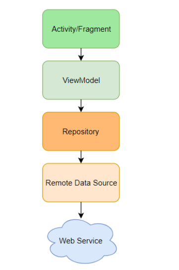
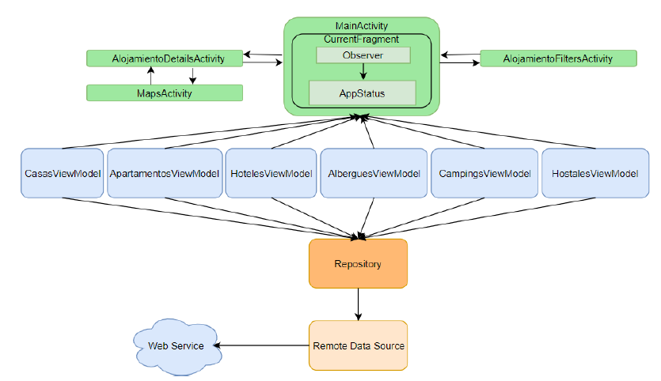
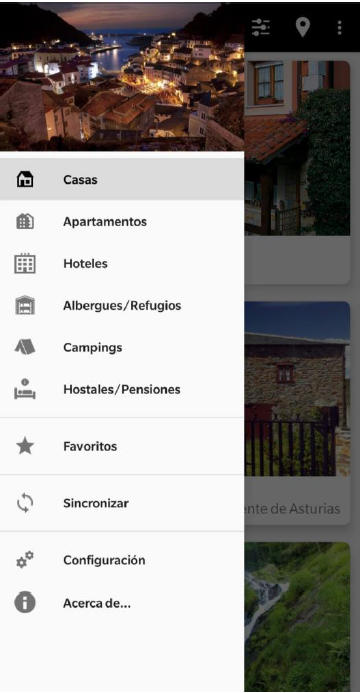

# ALOJAMIENTOS EN ASTURIAS

Alojamientos en Asturias es una aplicación creada con el fin de consultar los principales lugares donde se puede encontrar alojamiento
en Asturias. El repositorio incluye tanto el código como la apk.

# Arquitectura

La arquitectura de la aplicación sigue un modelo MVVM (Model-View-ViewModel), arquitectura de aplicaciones Android recomendada por Google,
tal y como se muestra en la siguiente Figura. Siguiendo el esquema, la arquitectura se separa en diferentes módulos, 
que procesan la información de la aplicación de forma desacoplada.

El tema principal de la aplicación son alojamientos en Asturias. Los datos se obtienen a partir de una fuente de datos remota.
Más abajo se muestra un esquema base de las principales clases que forman la arquitectura:
La pila superior está formada por los elementos correspondientes a la Vista (Actividades y Fragmentos). 
La aplicación está organizada en torno a un Drawer Layout, formado por distintos fragmentos,  contenidos en la actividad 
principal (MainActivity.java):

- Tipos de alojamiento: Casas, Apartamentos, Hoteles, Albergues, Campings y Hostales.
- Favoritos: alojamientos favoritos guardados por el usuario.
- Sincronización: botón que actualiza los datos.
- Menús de “Acerca de…” y “Configuración”.

La actividad mostrada en pantalla puede ser, además de la principal, los detalles de cada alojamiento, los filtros que se pueden aplicar 
(son distintos por cada tipo de alojamiento), así como los mapas en los que se muestran todos los alojamientos de un determinado tipo.

Los datos se descargan una vez se inicia la aplicación y al no esperarse cambios constantes, únicamente se vuelven a actualizar los 
datos por acción del usuario al pulsar el botón “Sincronizar” (o al volver a entrar a la aplicación). Por esta razón hay un observador 
(será un LiveData en cada ViewModel) sobre el estado de la aplicación para conocer si los datos están actualizados, están descargando 
o ha ocurrido un error para, en base a esta información, notificar al usuario adecuadamente.

Los fragmentos correspondientes a los distintos tipos de alojamientos obtienen los datos a través de un ViewModel, por lo que hay un 
ViewModel por cada tipo de alojamiento. El ViewModel establece una conexión con el repositorio. El repositorio (Repository.java) es 
un singleton en el que se almacena la información descargada y obtenida por el servicio web (WebService.java). Cada ViewModel pide al 
repositorio (siempre es el mismo, por eso es un singleton) únicamente los datos del tipo de alojamiento que necesita, es decir, 
CampingsViewModel.java únicamente obtiene los datos de los campings, por ejemplo. De esta manera se desacopla el acceso de los ViewModel 
a los distintos tipos de alojamientos.

Vista principal de la app:

